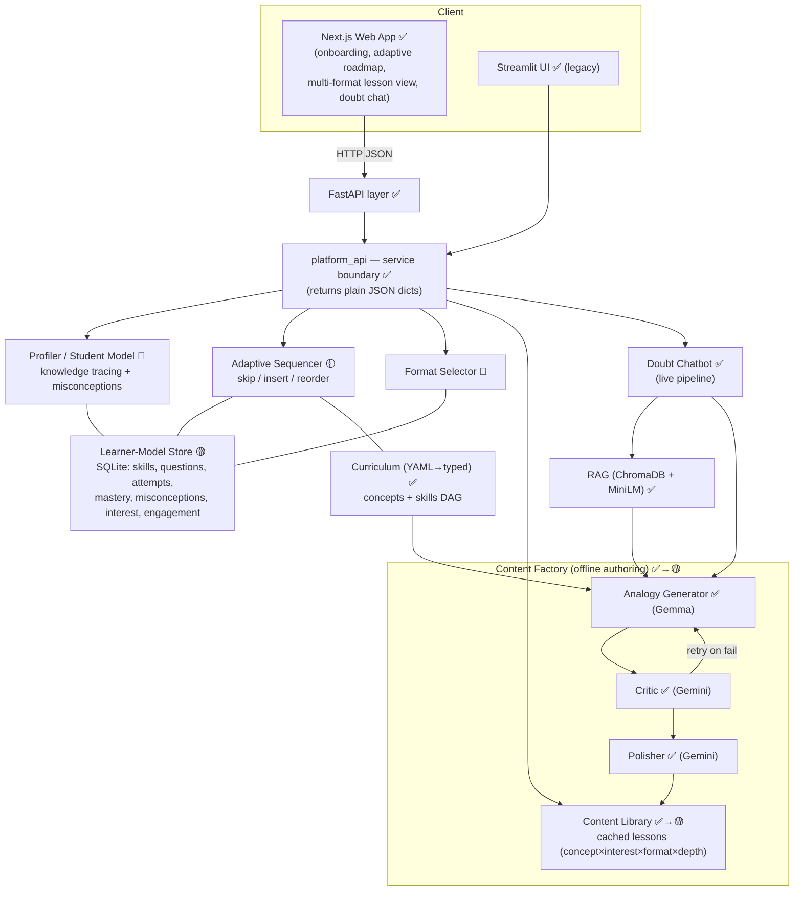
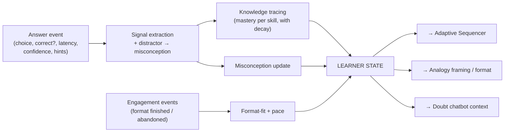
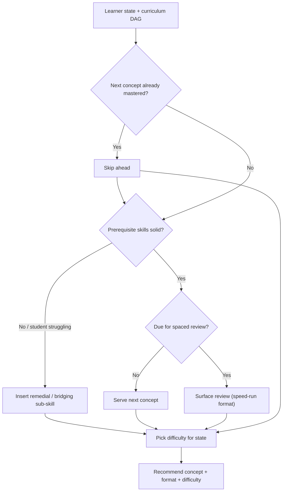

# EcoLearn — Roadmap (v2)

> **What this file is.** Everything still to be built, in the order to build it: the v2 target,
> the conventions that must not be violated, the target architecture and data model, and an
> ordered milestone plan with per-milestone files and acceptance criteria. It replaces the
> separate agent brief, feasibility report, and report content pack.
>
> **Read first:** [`PROJECT_HISTORY.md`](PROJECT_HISTORY.md) — what exists today and why.
>
> **Current position:** branch `auth-and-ux`. **Milestone 0: the backend auth core is done and
> tested (`tests/test_auth.py`, 60 checks); the HTTP layer and all frontend work are not started.**
> See §5 for exactly what remains and in what order.
>
> **Project goal:** the full Class 11 + 12 syllabus (28 chapters) × **15–20 interests** (up from
> 2), generated on a **self-hosted GPU LLM** rather than a paid API tier. See §1 for how that
> threads through the milestones. **When M0 is done, stop and ask the user every decision marked
> "after M0" in §15 before starting M1.**

---

## 1. The v2 target

A high-end adaptive tutor for **Class 11 & 12 Physics**:

- **Predetermined, multi-format, interest-skinned lessons** — every lesson pre-generated,
  critic-vetted, and re-skinned to the student's interest, served in varied pedagogical shapes
  so it never feels repetitive.
- **A diagnostic profiler** — per-skill knowledge tracing plus misconception detection, learning
  from *how* a student answers, not just whether they were right.
- **An adaptive sequencer** — dynamic **order**: skip mastered, insert remedial, reorder by pace,
  keep spaced review.
- **An interest-aware doubt chatbot** — already built; upgrade is to feed it persona + path context.

### The reframing that makes v2 affordable

> **Dynamic means reorder, not regenerate.** Content stays pre-generated and cached; only the
> *path* through it adapts.

Live LLM calls remain confined to the doubt chat and grading. That single constraint is why v2
fits the existing architecture instead of fighting it — and why nothing built so far is thrown
away. Every current asset (the boundary, the cached-lesson model, the four agents, RAG,
curriculum-as-YAML, the offline factory, Streamlit) **extends**.

### Shape of the work

Four expansions plus one addition plus one authoring marathon:

| | Subsystem | Today → v2 |
|---|---|---|
| 1 | **Progress store → learner-model store** | 2 tables → ~9. **The biggest change.** |
| 2 | **Path engine → adaptive sequencer** | static gating → insertion / placement / struggle logic |
| 3 | **Lesson schema/factory/service → variant-aware** | one template → format × depth variants |
| 4 | **Assessor → diagnostic** | a 0–3 score → tagged questions, distractor → misconception |
| 5 | **Auth layer (new)** | name-as-credential → real accounts |
| 6 | **Content marathon** | 17 concepts × 2 interests × 1 format → ~250 concepts × 15–20 interests × formats |
| 7 | **LLM backend** | Gemini API only, called directly from each agent → one provider layer; bulk generation on a self-hosted GPU, Gemini API kept as fallback |

**Size: XL overall** (multi-month for one dev), but phased so milestones 0–5 deliver a real
adaptive tutor before the content library is finished. Nothing here is a rewrite.

### Project goal: full syllabus × many interests × self-hosted LLM (set by the user, 2026-09-21)

The user wants EcoLearn to cover:

- **All of Class 11 and Class 12 Physics** — 28 chapters, ~250 concepts (today: 2 chapters, 17).
- **15–20 interests** (today: 2 — football and gaming).
- **Generated on a self-hosted LLM running on a GPU**, instead of paying for an API tier.

Together that is a content matrix of roughly **250 concepts × 20 interests × 5 formats ≈ 25,000
lessons**, against 34 today. The scale-up is not one milestone; it threads through the plan in
five pieces, ordered so that **no authoring is thrown away**:

| Piece | Where | What | Uses the LLM? | Redone after M6? |
|---|---|---|---|---|
| **Structure** | **M1** | Both axes of the content matrix: all 28 chapters + concepts + skills, **and an interest registry** for N interests. Schema, engine and UIs able to serve them | No | No |
| **LLM layer** | **M1a** (parallel with M1) | One provider layer for all agents; a self-hosted GPU backend; a quality-parity benchmark against today's Gemini output | For benchmarks | No |
| **Pilot** | **M1b** | One Class 12 chapter × a few interests (incl. new ones), generated **on the self-hosted model**, human-reviewed — a go/no-go gate on the thesis | A little | Yes, a few dozen lessons — deliberate |
| **Corpora** | **Track C** (parallel from M1) | RAG passages for every chapter and every interest × physics domain | Optionally, to draft | No |
| **Generation** | **M7** (after M6) | Every concept × interest × format | Heavily — GPU-bound | — |

The ordering principle: **do everything that is format-independent early** (structure, the LLM
layer, corpora), **de-risk the thesis cheaply** (pilot), and **generate in bulk only once** (after
M6 fixes the lesson formats). Several decisions shape this and belong to the user — see §15.

**Why the 10× interest multiplier changes the plan, not just the numbers.** At 2 interests,
hand-authoring corpora and hardcoding interest lists were fine. At 20: interests need a registry
(M1 Step 8), interest corpora become ~120 files and the real long pole (Track C, decision I3), the
lesson schema should stop regenerating interest-independent content 20 times (decision I2), and
the generated library outgrows git (decision I4).

The code audit behind this plan is already done: every "*Verified*" note in §6, §6a, §6b, §6c and
§12 was checked against the actual source on 2026-09-21. Re-check line-level details before
editing (code moves), but don't re-run the audit.

---

## 2. Non-negotiable conventions

Violating these breaks the project.

1. **UIs talk ONLY to the service boundary `src/platform_api.py`.** Never import
   engine/store/pipeline/agents directly from a UI. The web app goes
   `web/lib/api.ts` → FastAPI → boundary.
2. **The boundary returns plain JSON-serializable dicts/lists.** No Pydantic objects cross it.
3. **Cached vs live:** teaching content is pre-generated offline and served from cache. The
   **only** live LLM calls are the doubt chat (`ask_help`) and grading (`submit_assessment`).
   **Preserve this — it is the entire cost, latency and capacity strategy.** It still holds with a
   self-hosted GPU: a live lesson would take minutes (the doubt chat already takes ~2), and every
   concurrent student would compete for the same GPU. "Generation is free now" is not a reason to
   generate live.
4. **New chapter/subject = content (YAML + a factory run), not engine code.** Concept `order` is
   **global across the subject**; new chapters must continue the numbering or prerequisite
   validation rejects them.
5. **Tests are standalone scripts, NOT pytest.** Run e.g.
   `venv\Scripts\python.exe tests\test_path_engine.py`. `test_persistence.py` runs as two
   processes (`seed` then `verify`). Add new tests the same way: own `sys.path.insert`, set
   `ECOLEARN_PROGRESS_DB` to a temp file **before** importing the module, print-and-assert.
6. **Migrations are additive.** Extend the store in `_connect()` with `CREATE TABLE IF NOT
   EXISTS` plus `PRAGMA table_info` / `ALTER TABLE ADD COLUMN`; use a separate
   `CREATE UNIQUE INDEX` for uniqueness (SQLite rejects `ADD COLUMN … UNIQUE`). Legacy rows and
   Streamlit must keep working.
7. **Update the history file after any directory-touching change** (Changed / Why / Learned).
8. **Do NOT auto-commit or push.** The human runs commits. Work on a feature branch; suggest a
   branch for any `master` change.
9. **Models and providers.** *Today:* Gemma `gemma-4-31b-it` (generator/assessor) and Gemini
   2.5 Flash-Lite (critic/polisher) via the `google-genai` SDK; local `all-MiniLM-L6-v2`
   embeddings. *The plan (user decision, 2026-09-21):* bulk generation moves to a **self-hosted
   LLM on a GPU**, not a paid API tier — see M1a. **Until M1a lands, don't change provider code.**
   After M1a, **agents must call models only through `src/llm/`** — never a model SDK directly —
   and the backend/model is chosen per role by config. Don't introduce a third provider without
   asking. Judges fail open; key roles keep fallback chains (which may span backends).
10. **Never rename an existing unit, chapter or concept id.** Lesson filenames
   (`{concept_id}__{interest}.json`), student progress rows and tests are all keyed on them. A
   rename silently orphans all three. New ids must be unique across the whole subject.

### Environment gotchas (Windows / Next 16)

- **Next.js 16** renamed `middleware` → `proxy`, and `error.tsx` uses `unstable_retry` (not
  `reset`). **Read `web/node_modules/next/dist/docs/` before touching routing/cookies/error
  files** (per `web/AGENTS.md`). Do route protection with a **client guard, not `proxy.ts`** —
  the API cookie lives on a different origin, so a proxy on the web origin never sees it.
- Tailwind v4 token edits (`:root` / `.dark` / `@theme`) need a **dev-server restart**.
- Only **one** `next dev` per project dir. Busy ports throw `[WinError 10013]`.
- In PowerShell, `curl` is an alias — use `curl.exe`. `fetch` does not throw on HTTP 4xx/5xx.

---

## 3. Target architecture

v2 adds three brains around the existing core — a **Profiler**, an **Adaptive Sequencer**, and a
**Format Selector** — all reading a pre-built content library and a rich learner-model store.



### The profiler

**Signals captured per answer:** the chosen option (and via tagged distractors the *specific
misconception* it implies), correctness, response latency, self-rated confidence, hints used, and
which lesson formats the student finishes vs abandons.



It infers: **mastery per skill** (a probability with uncertainty, decaying over time),
a **misconception profile**, **learning pace** (fast / on-track / struggling), **format fit**, and
a ranked gap between the current skill vector and the syllabus target.

### The sequencer



### Lesson formats (rotated to sustain engagement)

- **Challenge-first** — pose an interest puzzle, let the student attempt, then reveal the concept.
- **Story / campaign** — embed the concept in an ongoing narrative in the student's world.
- **Worked → faded → solo** — a full worked example, then a half-scaffolded one, then independent.
- **Misconception-buster** — open with the common wrong intuition, then dismantle it.
- **Speed-run (review)** — a compressed, quiz-forward recap of a mastered concept.

---

## 4. Target data model

The store grows from two thin tables to a full learner model. **All additions are
migration-additive.**

```mermaid
erDiagram
    STUDENTS ||--|| INTEREST_PROFILE : has
    STUDENTS ||--o{ ATTEMPTS : makes
    STUDENTS ||--o{ MASTERY_ESTIMATES : has
    STUDENTS ||--o{ ENGAGEMENT_EVENTS : generates
    CONCEPTS ||--o{ SKILLS : "decomposes into"
    SKILLS ||--o{ QUESTIONS : "tested by"
    QUESTIONS ||--o{ DISTRACTORS : has
    DISTRACTORS }o--|| MISCONCEPTIONS : "maps to"
    QUESTIONS ||--o{ ATTEMPTS : "answered in"
    SKILLS ||--o{ MASTERY_ESTIMATES : "tracked per"
    CONCEPTS ||--o{ LESSON_VARIANTS : "taught by"
    LESSON_VARIANTS }o--|| INTEREST_PROFILE : "skinned to"

    STUDENTS { string student_id PK; string name; string email; string level; datetime created_at }
    INTEREST_PROFILE { string student_id FK; string primary_interest; json sub_interests; string depth }
    CONCEPTS { string concept_id PK; int global_order; json prerequisites }
    SKILLS { string skill_id PK; string concept_id FK; string name }
    QUESTIONS { string question_id PK; string concept_id FK; json skill_ids; int difficulty; string type }
    DISTRACTORS { string distractor_id PK; string question_id FK; string misconception_id FK }
    MISCONCEPTIONS { string misconception_id PK; string skill_id FK; string description }
    ATTEMPTS { string id PK; string student_id FK; string question_id FK; string chosen; bool correct; int latency_ms; int confidence; datetime ts }
    MASTERY_ESTIMATES { string student_id FK; string skill_id FK; float p_known; float uncertainty; datetime updated_at }
    LESSON_VARIANTS { string concept_id FK; string interest; string format; string depth; string body_ref }
    ENGAGEMENT_EVENTS { string student_id FK; string kind; string ref; datetime ts }
```

The profiler's **inference layer sits on top of these tables, not in SQL**: knowledge tracing
(start with EMA + time-decay per skill; upgrade to Bayesian Knowledge Tracing), misconception
detection from tagged distractor picks (plus optional free-text via the Assessor), and a
pace/format-fit summary. Output = a **learner-state dict** consumed by the sequencer, generator,
and chatbot. Keep it behind the boundary as plain data.

---

## 5. MILESTONE 0 — Accounts, auth & UX foundation ← **CURRENT**

**Goal:** real email/password accounts with a server-enforced session, durable profiles, and the
UX baseline (toasts, error boundaries, skeletons, real forms, chapter picker, dark mode). Closes
the "name = credential" hole and the refresh-logout problem.

### Progress so far — backend auth core DONE and TESTED

**`tests/test_auth.py` → 60 checks pass.** Run it before touching anything here; it is the
regression net for everything below.

- ✅ `src/errors.py` — `EcoLearnError(ValueError)` + `NotFoundError` / `ConflictError` / `AuthError`.
- ✅ `src/auth/passwords.py` — bcrypt directly (**not passlib**), 72-**byte** limit guarded at
  register *and* login, `verify_password` never raises, `dummy_verify` for constant-time unknown
  emails.
- ✅ `src/progress/store.py` — idempotent migration in `_connect()` adding nullable
  `email` / `password_hash` + `CREATE UNIQUE INDEX idx_students_email`; new `get_student_by_email`,
  `save_student_with_credentials`, `update_student_profile`, `update_student_password`,
  `get_password_hash`. `get_student` whitelists fields so `password_hash` can never leak.
  Verified against a synthetic old-shape DB.
- ✅ `src/platform_api.py` — `register_student`, `authenticate_student` (identical error message
  on both failure branches), `get_student_profile`, `update_student_profile`, `change_password`.
  Account ids `"stu_" + uuid4().hex`, provably disjoint from legacy slugs. `_slugify` and
  `create_or_load_student` **unchanged** (`tests/test_platform_api.py` pins
  `student_id == "journey-student"`; Streamlit depends on it).
- ✅ `src/path/engine.py` — unknown chapter raises `NotFoundError`.
- ✅ `pyjwt` + `bcrypt` declared in `requirements.txt` and installed.
- ✅ `tests/test_auth.py` — 60 deterministic checks over the migration, password edge cases, all
  five boundary functions, and the legacy contracts.

### Remaining — backend

- `api/security.py` — PyJWT HS256, claims `{sub, iat, exp}`, ~7-day TTL, secret from
  `ECOLEARN_JWT_SECRET` (dev default + warning; raise at import if unset in production).
  httpOnly cookie, `samesite="lax"`, `secure` in prod. `get_current_student_id(request)`
  dependency → 401.
- `api/main.py` — CORS `allow_credentials=True` (comment that this is incompatible with
  `allow_origins=["*"]`). New endpoints: `POST /api/auth/register|login|logout`,
  `GET /api/auth/me`, `POST /api/auth/change-password`, `GET /api/chapters` (wraps
  `list_chapters`), `PATCH /api/profile`. Exception handlers: `NotFoundError` → 404,
  `ConflictError` → 409, `AuthError` → 401, `EcoLearnError`/`ValueError` → 400,
  **`RuntimeError` → 503** (passing through `submit_assessment`'s user-ready message).
*(Already done 2026-09-21: `tests/test_auth.py` (60 checks), `requirements.txt` declaring
`bcrypt` + `pyjwt`, and `.env.example` documenting `ECOLEARN_JWT_SECRET`.)*

### Remaining — frontend (`web/`)

- `lib/api.ts` — one `request()` wrapper (kills the 5× duplication), `credentials:"include"`,
  typed `ApiError(status, detail)`, parse FastAPI `{detail}`, per-call timeouts (default 15s;
  **90s for `askHelp`/`submitAssessment`** — live LLM), `setUnauthorizedHandler` callback (no
  router import). New fns: `register` / `login` / `logout` / `getMe` / `updateProfile` /
  `changePassword` / `getChapters`.
- `components/auth-provider.tsx` — replaces `student-provider.tsx`; tri-state
  `loading | authenticated | unauthenticated`; hydrate via `getMe()` on mount (the cookie is
  httpOnly, so JS can't read it). Migrate the 4 call sites.
- `/login` and `/signup` — signup is a 2-step wizard that **absorbs `/onboarding`** (step 1
  email/password/name, step 2 interest/level; one `register` call). Delete
  `app/onboarding/page.tsx`. Extract `components/interest-level-fields.tsx` for reuse in settings.
- `components/require-auth.tsx` + an `app/(app)/layout.tsx` route group — move
  `roadmap`/`lesson`/`assessment`/`settings` under it (**parens = no URL change**). **Client
  guard, not `proxy.ts`**: the real security boundary is the API's `Depends`, not the guard.
- shadcn add: `label sonner skeleton dropdown-menu avatar sheet select separator alert form` +
  `next-themes`. Pin the CLI to the installed shadcn version; if it injects `@radix-ui/react-*`,
  rewrite to the unified `radix-ui` import to match convention. Add `<Toaster>`, `app/error.tsx`
  (use `unstable_retry`), `app/global-error.tsx`, `app/not-found.tsx`,
  `components/ui/skeleton.tsx` (replacing 3 hand-rolled pulse blocks),
  `components/error-state.tsx`, and `lib/errors.ts` `friendlyMessage()` — **stop leaking
  `localhost:8000` to users**.
- Forms via react-hook-form + zod (real `<form>`, Enter-to-submit, `aria-invalid` for free).
- **Chapter picker** via a `?chapter=` URL param: delete the hardcoded const from the
  roadmap/lesson/assessment pages; add `lib/chapters.ts` (`DEFAULT_CHAPTER_ID`),
  `lib/use-chapter.ts`, `components/chapter-picker.tsx`; wrap page bodies in `<Suspense>`
  (Next 16 `useSearchParams` bailout). This exposes the already-built Chapter 2 (`motion_plane`).
  **Build it for 28 chapters, not 2:** M1 grows the curriculum to 28 chapters and enriches
  `GET /api/chapters` with `unit_id`, `unit_name` and `grade`. Type the chapter as an extensible
  object and structure the picker to group by class → unit, so M1 adds fields rather than
  rewriting the component. Don't hardcode a flat two-item list anywhere.
- **Build the interest picker for ~20 interests, not 2.** *Verified:* `web/app/onboarding/page.tsx`
  hardcodes a two-item `INTERESTS` array rendered as two large cards. When `interest-level-fields.tsx`
  is extracted for signup + settings, read interests from **one typed list** (`lib/interests.ts`)
  shaped like the future `GET /api/interests` response (`id`, `label`, `emoji`), and lay it out as
  a grid or chips that still works at 20. M1 Step 8 then swaps the source to the API.
- **Fix dark mode:** `theme-provider.tsx` (next-themes, `attribute="class"`),
  `suppressHydrationWarning` on `<html>`, and rewrite the `.dark` block in `globals.css` to carry
  the brand (it's currently untouched shadcn neutral — `--brand-accent` / `--success` aren't even
  redefined).
- Nav: `site-nav.tsx` → Client Component with active links, a user menu (avatar + dropdown), and
  a mobile Sheet. `app/(app)/settings/page.tsx` — change name/interest/level
  (`PATCH /api/profile`) + change password.

### THE BREAKING FLIP — do in ONE commit, do not split

Add `Depends(get_current_student_id)` to `/api/roadmap`, `/api/next-lesson`, `/api/assessment`,
`/api/help`; **drop `student_id` from their request contracts** (derive it from the token);
**delete `POST /api/student`**; and simultaneously strip `studentId` from every
`web/lib/api.ts` signature. Verify with `tsc --noEmit` — stale call sites become compile errors.

### Acceptance

Register → login sets an `HttpOnly; SameSite=lax` cookie; `GET /api/auth/me` returns 200 with the
cookie and **401 (not 500)** without it; protected endpoints 401 without a token; unknown chapter
→ 404; `tsc --noEmit`, `npm run build`, and all deterministic tests pass; **Streamlit still works**.

---

## 6. MILESTONE 1 — Full content spine: 28 chapters, fine-grained skills, and an interest registry

**Goal:** author the complete **structure** of the content matrix along both of its axes — every
chapter, concept and sub-skill of Class 11 + 12 (Steps 1–7), and a registry for 15–20 interests
(Step 8) — and make the engine and UIs able to serve it. This is the structural half of the
scale-up. The content half (RAG corpora, lessons) is Track C, M1b and M7.

> **Why these two jobs are one milestone.** Decomposing concepts into skills and adding 26
> chapters edit the *same two files* (`physics.yaml`, `schema.py`). Doing them together means each
> of ~250 concepts is authored **once**, with its skills, instead of revisited in a second pass.
> Skills also gate the whole data model (M2), so they have to come early regardless.

> **No LLM quota is spent in this milestone.** It is YAML, schema, engine code and tests. None of
> it is invalidated by M6's multi-format change.

**Before starting: confirm decisions S1, S2 and I1 with the user (§15).**

### Step 1 — 🔴 fix the silent duplicate-id bug FIRST

*Verified in code:* `_by_id()` in `src/curriculum/loader.py` is
`{c.id: c for c in all_concepts(subject)}`, so a duplicate concept id **silently overwrites** —
last one wins, no error. Harmless at 17 concepts. At ~250 a collision (`energy`, `field`,
`potential`, `resistance`, …) is likely — and because lessons are stored as
`data/lessons/{concept_id}__{interest}.json`, a collision also makes one chapter's lesson silently
**overwrite another's on disk**.

Add an id-uniqueness check run at load (alongside `validate_ordering`), rejecting duplicate
concept, chapter, unit and (once they exist) skill ids with a message naming both locations. Test
it against a fixture YAML that contains a duplicate. **Do this before authoring a single new
concept.**

### Step 2 — schema (`src/curriculum/schema.py`)

- **`grade: int`** (11 | 12) on `Unit` — CBSE units never straddle classes. Have the loader stamp
  it down onto chapters and concepts, exactly as it already stamps parent ids.
- **`skills: list[Skill]`** under each `Concept`, with `Skill{id, name, description}`; ids unique
  subject-wide (Step 1 enforces it). Default granularity: **2–5 skills per concept**.
- **Fix the `Concept.order` docstring.** It says "within the chapter"; `order` is **global**
  across the subject. An author who follows the docstring will break validation.
- *(Optional)* let the loader merge several YAML files (e.g. one per class) — only if a single file
  becomes unmanageable (~2,500+ lines).

### Step 3 — ordering scheme (decision S1)

`order` today is contiguous integers 1–17, global. NCERT Class 11 **chapter 1 (Units and
Measurement) comes before the existing concept #1 (`position`)** — and a contiguous integer scheme
can't insert before 1.

Recommended: **sparse ordering** — renumber once in steps of 10, leaving gaps for future inserts.

Renumbering is **safe** — *verified*: no test pins `order` values (they check only relative
order), and progress rows are keyed on `concept_id`, never on `order`.

### Step 4 — author the skeleton (`data/curriculum/physics.yaml`)

Target structure, from the **NCERT 2023-24 rationalised** syllabus. **Verify against the current
CBSE syllabus before authoring** — this list may be a year stale.

| Class | CBSE unit | Chapters |
|---|---|---|
| 11 | Physical World & Measurement | Units and Measurement |
| 11 | Kinematics *(exists)* | Motion in a Straight Line *(exists)* · Motion in a Plane *(exists)* |
| 11 | Laws of Motion | Laws of Motion |
| 11 | Work, Energy and Power | Work, Energy and Power |
| 11 | Motion of System of Particles & Rigid Body | System of Particles and Rotational Motion |
| 11 | Gravitation | Gravitation |
| 11 | Properties of Bulk Matter | Mechanical Properties of Solids · Mechanical Properties of Fluids · Thermal Properties of Matter |
| 11 | Thermodynamics | Thermodynamics |
| 11 | Behaviour of Perfect Gases & Kinetic Theory | Kinetic Theory |
| 11 | Oscillations and Waves | Oscillations · Waves |
| 12 | Electrostatics | Electric Charges and Fields · Electrostatic Potential and Capacitance |
| 12 | Current Electricity | Current Electricity |
| 12 | Magnetic Effects of Current & Magnetism | Moving Charges and Magnetism · Magnetism and Matter |
| 12 | EMI and Alternating Current | Electromagnetic Induction · Alternating Current |
| 12 | Electromagnetic Waves | Electromagnetic Waves |
| 12 | Optics | Ray Optics and Optical Instruments · Wave Optics |
| 12 | Dual Nature of Radiation and Matter | Dual Nature of Radiation and Matter |
| 12 | Atoms and Nuclei | Atoms · Nuclei |
| 12 | Electronic Devices | Semiconductor Electronics |

**14 chapters per class, 28 total. You have 2.** At ~8–10 concepts each: **~250 concepts**.

Authoring rules:
- **Never rename an existing id** — `kinematics`, `motion_straight_line`, `motion_plane`, and all
  17 concept ids. The 34 lesson files, student progress rows, and tests are keyed on them.
- Concept ids must be unique across the **whole subject** (Step 1 enforces it). Prefer specific ids
  (`electric_potential_energy`, not `potential_energy`).
- Cross-class prerequisites are expected (Coulomb's law → force, vectors). That is why this stays
  one subject (decision S2).
- Each concept needs `name`, `prerequisites`, `learning_objective` (an observable action),
  `bloom_target`, `order`, and `skills`.
- Rewrite the file's header comment and the subject `description` — both still say "Class 11 …
  kinematics, dynamics".

### Step 5 — engine (`src/path/engine.py`)

- **Cache `_load_subject()`**, keyed on (path, file mtime). *Verified:* it re-reads and
  re-validates the whole YAML on **every call**, and one `get_next_lesson` request calls it several
  times. Trivial at 17 concepts, real latency at 250.
- **Filter by grade.** *Verified:* the student's `level` is **never used by the engine** — it only
  reaches the generator — so a Class 12 student would be served Class 11 chapter 1. Map
  `level` ("Class 12") → `grade` (12).
- **Enrich `list_chapters()`** with `unit_id`, `unit_name`, `grade`, `concept_count`. *Verified:* it
  returns a flat `[{id, name}]` today, which a UI can't group.
- **"Next chapter."** When a chapter is fully cleared, `next_concept` returns `done` and stops.
  Recommend the next chapter in order instead — a dead end is fine with 2 chapters, not with 28.
- **`get_class_overview(student_id, grade)`** → per-chapter cleared / mastered / total, so the UI
  isn't 28 separate roadmaps.

### Step 6 — boundary, HTTP, UIs

- `src/platform_api.py`: grade-aware `list_chapters`, new `get_class_overview`. Plain dicts.
- `api/main.py`: `GET /api/chapters` (added in M0) returns the richer shape; add
  `GET /api/overview`. Both behind auth.
- Web: the chapter picker groups **class → unit**; add a class-overview page; default the chapter
  from the student's grade.
- Streamlit: `ui_common.chapter_selector` is a flat `st.selectbox` and `ui_common.py` has a
  hardcoded `CHAPTER_ID` constant at the top. Group it, or accept the flat list (it's legacy).

### Step 7 — new concepts have no lessons yet, and that is expected

`get_next_lesson` already returns `status: "lesson_missing"` for a concept with no cached lesson.
~230 new concepts will hit that until M1b / M7 generate them — it becomes **the most common screen
in the app**, where today it never appears (all 17 concepts have lessons).

*Verified:* the status is handled, but badly for a student:
- The `reason` text set in `get_next_lesson` (`src/platform_api.py`) is **developer-facing** —
  *"No pre-generated lesson exists for {concept} in interest '{interest}' yet. Generate it with the
  lesson factory."* — and it reaches the student verbatim.
- `web/app/assessment/page.tsx` has no `lesson_missing` branch: a null lesson falls into its
  generic **error** state and shows that `reason` string.
- `web/app/lesson/page.tsx`, `pages/2_Lesson.py` and `pages/3_Assessment.py` do reference
  `lesson_missing` — check what each actually renders.

Fix: a student-facing "this lesson is coming soon" state in every lesson and assessment view,
driven by `status`, never by displaying `reason`. Keep the developer detail in the envelope for
logs, or move it to a separate field.

### Step 8 — the interest registry (the second axis of the matrix)

*Verified:* **there is no registry of interests anywhere.** A student's interest is free text,
checked only for being non-blank (`register_student` in `src/platform_api.py`), and the two
interests are hardcoded in three separate places:

- `web/app/onboarding/page.tsx` — a two-item `INTERESTS` array
- `app.py` (Streamlit) — `options=["Football", "Gaming"]`
- `src/content/generate_lessons.py` `__main__` — `["football", "gaming"]`, twice

So an interest typed or added anywhere else would be accepted, then silently get
`lesson_missing` on every concept. At 2 interests that never happens; at 20 it will.

Build:
- **`data/interests.yaml`** — the single source of truth. Per interest: `id` (lowercase slug —
  it's in lesson filenames), `label`, `emoji`, a one-paragraph `description` the generator can use
  for grounding, `domains` (which physics domains its corpus covers — see Track C), and
  **`status: active | draft`**.
- A Pydantic model + loader with validation (unique ids, known domains) — alongside
  `src/curriculum/`.
- **Only `active` interests are offered to students.** An interest becomes `active` only once its
  lessons exist for the chapters on offer — otherwise a student picks it and meets "coming soon"
  on every screen. `draft` interests are still generated by the factory.
- Boundary: `list_interests(active_only=True)`, plain dicts. **Validate** the interest in
  `register_student` and `update_student_profile` against the registry. Leave
  `create_or_load_student` behaviour unchanged unless you verify Streamlit and
  `test_platform_api.py` only ever pass registry ids (they pass `football`).
- HTTP: `GET /api/interests`. Web: swap the M0 `lib/interests.ts` list for the API. Streamlit:
  read the options from the boundary instead of the hardcoded list.
- Factory: `--interest all` reads the registry; ingest warns when a corpus directory has no
  registry entry, or a registry domain has no corpus file.
- **Never rename `football` or `gaming`** — the 34 lesson filenames and existing student profiles
  store those exact strings (rule 10).

Which 15–20 interests is decision **I1** — the user's call.

### Acceptance

- The loader loads all 28 chapters; duplicate concept / chapter / unit / skill ids are **rejected**
  with a clear message (proven by a bad-fixture test).
- Every unit has a grade; every concept has ≥ 1 skill; every prerequisite resolves; global order
  validates.
- `tests/test_curriculum.py` extended to cover all of the above. `test_auth`, `test_path_engine`,
  `test_edge_states`, `test_scale_chapter2`, `test_persistence` pass **unchanged**.
- A Class 12 student's default chapter is a Class 12 chapter.
- A concept without a lesson shows `lesson_missing` gracefully in both UIs.
- `data/interests.yaml` lists the chosen interests; `football` and `gaming` are `active`, the rest
  `draft`. No interest list is hardcoded anywhere in the web app, Streamlit or the factory.
  Registering with an unknown interest is rejected with a clear error (tested).

---

## 6a. MILESTONE 1a — LLM provider layer + self-hosted GPU backend (parallel with M1)

**Goal:** make every agent model-agnostic, add a backend for a **self-hosted LLM on a GPU**, and
prove it produces lessons as good as today's before anything is generated on it.

**Why now, and why before the pilot.** ~25,000 lessons is ~75k–125k LLM calls — impossible on a
free tier and the reason the user chose a GPU over a paid tier. And the M1b pilot exists to
validate the lesson quality that will actually ship, so it must run **on the model that will do
the bulk generation**. M1a is independent of M1 (different files), so the two run in parallel.

**Before starting: get L0–L3 from the user (§15)** — above all, which GPU (VRAM), where it runs,
and whether it's always on.

### Step 1 — one provider layer (`src/llm/`)

*Verified:* **there is no shared LLM layer.** Each of the four agents —
`src/agents/{analogy_generator,critic,assessor,polisher}.py` — independently does
`from google import genai`, builds its own `genai.Client(api_key=...)`, calls
`client.models.generate_content`, and applies Gemini-only options inline:
`response_mime_type="application/json"` for strict JSON (critic, assessor) and `thinking_config`
(generator, critic, assessor, polisher). Fallback chains are hardcoded tuples of Gemini model names
(`_FALLBACK_MODELS` in `assessor.py` and `polisher.py`). Swapping providers today means editing
four copies of provider logic.

Build one interface, e.g. `generate(role, prompt, *, json_schema=None, temperature, max_tokens)
-> str`, with two backends:

- **`gemini`** — today's code, moved behind the interface. Behaviour must not change.
- **`openai_compat`** — any OpenAI-compatible server. vLLM, Ollama, llama.cpp server and TGI all
  expose one, so one backend covers every serving option.

Then refactor the four agents to call it. Per role (generator / critic / polisher / assessor),
config selects the backend and model: e.g. `LLM_BACKEND_CRITIC=openai_compat`,
`CRITIC_MODEL=...`, plus `LOCAL_LLM_BASE_URL` and `LOCAL_LLM_API_KEY`. Keep the existing
`*_MODEL` env vars working.

### Step 2 — move model quirks into the layer, as capability flags

- **JSON strictness.** The critic and assessor rely on Gemini's `response_mime_type`. On the
  local server use **guided / structured decoding** (vLLM supports JSON-schema-guided output;
  Ollama supports a JSON `format`). Keep the existing parse-and-retry as the backstop.
- **`thinking_config`** is Gemini-only — the layer applies it only where supported.
- **The Gemma system-prompt constraint still applies locally.** Gemma's chat template has no
  system role, which is why the agents prepend the system prompt to the user message
  (`PROJECT_HISTORY.md` §6). Turn that into a per-model flag in the layer (`supports_system_role`)
  instead of per-agent code — and keep it `False` for Gemma.
- **The anti-scratchpad defence is unchanged.** Reasoning-style open models leak planning notes at
  least as badly as the API ones. Polish, then parse.

### Step 3 — backend-aware fallback + pacing + concurrency

- Fallback chains may span backends — e.g. local model → Gemini API. That keeps generation alive
  when the GPU is down (decision L4). Judges still fail open.
- *Verified:* free-tier pacing is hardcoded — `_INTER_STEP_DELAY_SECONDS = 13` in
  `src/pipeline.py`, `_INTER_LESSON_DELAY_SECONDS = 5` in `generate_lessons.py`. Make both
  configurable and **0 for a local backend** — a self-hosted model has no rate limit, so those
  sleeps would be pure waste (~18–44 s per lesson).
- **Bounded concurrency in the factory is now recommended, not optional.** The factory is strictly
  sequential; servers like vLLM batch concurrent requests, so one-at-a-time leaves most of the GPU
  idle.
- *Verified:* `src/agents/analogy_generator.py` is the only key agent with **no** fallback chain.
  The layer fixes that for free.

### Step 4 — choose models per role (decision L2), by benchmark, not by assumption

- 🔴 **Don't assume one model can do every role.** `PROJECT_HISTORY.md` records that Gemma
  (`gemma-4-31b-it`) produced cleanly usable **polisher** output for only **2 of 11** lessons,
  versus reliable results from Flash-Lite. The polisher and critic need strict instruction
  following and JSON discipline; the generator needs creativity.
- The prompts were tuned against Gemma. If the exact model is available as open weights, hosting
  it keeps generator behaviour closest — **confirm availability and licence first**.
- VRAM rule of thumb: ~2 bytes per parameter at 16-bit precision, ~0.5–0.6 at 4-bit quantisation,
  **plus** headroom for the KV cache. A ~30B model needs ~60 GB+ unquantised, ~18–20 GB at 4-bit.
  Size against the user's actual GPU (L0).

### Step 5 — the parity gate

Before the pilot, run the existing live harnesses **on both backends** and compare:
- `tests/benchmark_analogy.py` and `tests/benchmark_v3.py` (10-case analogy benchmarks, the latter
  with RAG), `tests/test_critic.py`, `tests/test_assessor.py`, `tests/test_pipeline.py`.
- Compare critic first-pass rate, scratchpad leakage after polishing, JSON parse failures, and a
  human read of a sample.
- Record results in `PROJECT_HISTORY.md`. **The user decides whether parity is good enough.**

### Step 6 — operations and security

- **Never hardcode the server URL.** The deleted `testremote.py` hardcoded a Cloudflare
  quick-tunnel URL for an Ollama box, and died with the tunnel. `LOCAL_LLM_BASE_URL` comes from
  env only.
- If the GPU box is reachable over a network, **put auth in front of it** — an open LLM endpoint
  is free compute for anyone who finds it.
- `requirements.txt` gains an OpenAI-compatible client (e.g. `openai`, or plain `httpx`);
  `.env.example` documents every new variable. Don't add either until the code uses them.
- **Live traffic (decision L1):** if the GPU is batch-only, the doubt chat and grading stay on the
  Gemini API; if it's always on, they can move to it. The provider layer supports both — it's a
  config change, not a code change.

### Acceptance

- All four agents call models only through `src/llm/`; no agent imports a model SDK directly.
- With `gemini` configured, behaviour is unchanged — the live tests pass as before.
- With `openai_compat` configured against the GPU server, the full pipeline (retrieve → generate
  → critic → retry → polish) produces a servable lesson, and the assessor returns valid JSON.
- A local → Gemini fallback is demonstrated by stopping the local server mid-run.
- The parity benchmark is recorded and the user has signed off on it.

---

## 6b. MILESTONE 1b — Class 12 pilot (a go/no-go gate)

**Goal:** before investing in M2–M6, prove three things at once, cheaply:
1. interest-skinned analogies survive **abstract, non-mechanical physics**;
2. they work for **interests beyond football and gaming**;
3. the **self-hosted model** (M1a) produces lessons good enough to ship.

Everything built so far is kinematics × two sports-and-games interests on the Gemini API — the
easiest possible case. Class 12 is electricity, magnetism, optics and modern physics; the new
interests may include things far from motion. **If the core thesis breaks, find out now**, not
after building the profiler on top of it.

**Pilot chapter: Current Electricity** (Class 12). Deliberately a stress test — abstract,
diagram-heavy (circuits), and about as far from football as the syllabus gets.

**Pilot interests:** `football` and `gaming` (the baseline) **plus 1–2 new ones from decision
I1** — ideally one sport and one non-sport, so the pilot shows whether the approach generalises.

### Build first

1. **M1a complete** — provider layer, GPU backend, configurable pacing, generator fallback, and
   the parity benchmark signed off by the user. The pilot runs **on the self-hosted model**.
2. **Factory CLI** (`src/content/generate_lessons.py`). *Verified:* the `__main__` block
   **hardcodes** `chapter_id="motion_straight_line"` and `["football", "gaming"]`. Add
   `--chapter`, `--grade`, `--all`, `--interest` (accepting `all`, read from the registry), and
   **`--dry-run`** (prints the lesson count and estimated LLM calls; generates nothing).
3. **M1 Step 8** — the pilot's new interests exist in `data/interests.yaml` as `draft`.
4. **Track C, for this slice only:** current-electricity curriculum passages, electricity-domain
   interest passages for every pilot interest, and chapter-filtered retrieval.
5. **Prompts.** *Verified:* both few-shot examples in `prompts/analogy_generator.txt` are mechanics
   (relative velocity, work-energy theorem) — the model has never been shown a structurally sound
   electricity or optics analogy. Add one non-mechanics example. Let the generator **decline a
   forced analogy** and give a direct explanation instead, and update `prompts/critic.txt` so the
   critic treats an honest decline as passable. (The risk table already names this mitigation.)
6. Remember the Gemma constraint while editing agents: **no `system_instruction`, no
   `thinking_config`** (`PROJECT_HISTORY.md` §6).

### Run

- `--dry-run` first. Then generate the chapter for every pilot interest — roughly 10 concepts ×
  3–4 interests ≈ **30–40 lessons** — on the GPU.
- **Measure throughput** (lessons per GPU-hour, with concurrency on). This is the number that turns
  M7 from a guess into a schedule.
- Spot-check KaTeX rendering on circuit math.

### Evaluate — a human reads every lesson

Write up in `PROJECT_HISTORY.md`: critic first-pass rate for this chapter vs the kinematics
chapters, **broken down by interest**; how many analogies were forced vs declined, per interest;
whether circuit concepts are teachable without a diagram; and the measured throughput.

### Gate — the user decides, not the agent

- **GO** → proceed to M2. The findings inform the diagrams decision (S3).
- **ADJUST** → analogies weak in some domains: decide on per-domain direct-explanation fallback or
  richer interest corpora before scaling further.

Present the findings and let the user make the call. Do not self-approve the gate.

> The pilot lessons are in today's single format, so M7 will regenerate them in multi-format.
> That's a few dozen lessons of deliberate throwaway GPU time, bought to de-risk the whole thesis
> — and the throughput measurement alone is worth it.

### Acceptance

Pilot lessons generated, cached and servable in both UIs; findings written up; the user's go/no-go
recorded in `PROJECT_HISTORY.md`.

---

## 6c. TRACK C — Content corpora (runs in parallel from M1 onward)

**Goal:** give RAG enough authoritative text to ground lessons for all 28 chapters.

This is **the long pole** of the scale-up — authoring, not code — and it doesn't depend on M2–M6,
so it runs alongside them. The project's own hardest-won lesson applies: *half of "the model is
hallucinating" is "the corpus didn't contain the fact."*

### C1 — 🔴 interest corpora by physics domain (the biggest content gap)

*Verified:* `src/data/interests/football.md` and `gaming.md` are 20 passages each, and **every one
is mechanics** — sprint speeds, pass and shot speeds, trajectories, pitch friction; racing
acceleration, projectiles, physics engines. There is **nothing** to ground an analogy for heat,
electricity, magnetism, optics or modern physics. Without new passages the generator will invent
facts, which is exactly the failure RAG was built to prevent.

Target layout — move each existing file to `mechanics.md`:

```
src/data/interests/football/{mechanics,thermal,electricity,magnetism,optics,modern}.md
src/data/interests/gaming/{mechanics,thermal,electricity,magnetism,optics,modern}.md
```

Seed ideas (verify every figure before it goes in — accuracy is the whole point):

| Domain | Football | Gaming |
|---|---|---|
| Thermal | ball and boot heating, player thermoregulation, cold-weather ball pressure | GPU/CPU heat and cooling, thermal throttling |
| Electricity | stadium floodlight circuits, scoreboards, goal-line tech power | battery current and capacity, charging, controller circuits |
| Magnetism | goal-line tech sensors, broadcast equipment | wireless controllers, speakers, haptic motors |
| Optics | VAR and broadcast camera lenses, floodlight glare | display refresh and pixels, VR lenses, ray tracing |
| Modern | fibre-optic broadcast feeds, sensor chips | semiconductors in GPUs, LEDs in RGB gear |

**Generalised to N interests:** `src/data/interests/<interest_id>/<domain>.md`, one directory per
registry id. The size of this job is what makes it the long pole:

> **15–20 interests × 6 domains ≈ 90–120 files × ~10–15 passages ≈ 1,000–1,800 passages** of
> real, checkable facts — against 40 passages today.

Three rules keep that tractable:

- **The matrix may be sparse.** Not every interest grounds every domain — music is a natural fit
  for waves and oscillations and a weak one for rotational dynamics. The registry's `domains`
  field records what exists. Where an interest has no corpus for a domain, the generator uses the
  **decline-a-forced-analogy** path (M1b, prompts) and teaches directly, rather than inventing
  facts. A missing file is a known gap, not an error.
- **Sourcing is decision I3.** Hand-authoring ~1,500 passages is weeks of work. The recommended
  route is **LLM-drafted on the GPU, then human fact-checked** — the GPU makes drafting cheap, but
  an unchecked corpus defeats the entire purpose of RAG.
- **Unverified text never grounds a lesson.** Each passage carries a `verified` marker; ingest
  skips unverified passages so they're never indexed. A drafted-but-unchecked corpus is
  therefore safe to commit — it just isn't used yet.

### C2 — the ingest change C1 requires

*Verified:* `src/rag/ingest.py` sets `interest_name = md_path.stem`. With per-domain files,
`football/optics.md` would register **"optics" as an interest**. Derive the interest from the
**parent directory** and record the stem as `domain` metadata.

### C3 — curriculum corpora for all 28 chapters

*Verified:* two files today — `src/data/curriculum/physics_kinematics.md` (12 passages) and
`physics_work_energy.md` (10). Author ~8–15 NCERT-aligned passages per chapter, each a
self-contained `##` section (headings are the chunk boundaries). One file per chapter, **named by
chapter id** (e.g. `current_electricity.md`), so ingest can derive chapter metadata from the
filename.

### C4 — chapter-filtered retrieval

*Verified:* `retrieve_concept()` in `src/rag/retrieve.py` queries the **entire** curriculum
collection with no filter. At 28 chapters, "velocity" will pull *drift* velocity from Class 12, and
"field" mixes gravitational, electric and magnetic fields.

- Tag curriculum chunks with `chapter_id` and `grade` at ingest.
- Filter retrieval to the concept's chapter plus its prerequisites' chapters.
- Thread an optional `chapter_id` through `explain_with_review` in `src/pipeline.py`, which takes
  only a concept string today.

`src/rag/build_index.py` already deletes and recreates its collections, so rebuilds are idempotent
— no change needed there.

### Acceptance

- `tests/test_retrieval.py` extended: a query filtered to a chapter returns only that chapter's
  passages; the interest filter returns only that interest; `domain` metadata is present.
- Every chapter has a curriculum corpus file. Every interest has a corpus file for each domain
  listed in its registry entry, and ingest reports the interest × domain coverage matrix.
- Unverified passages are provably excluded from the index (tested).

## 7. MILESTONE 2 — Learner-model data layer

**Goal:** grow the store to the target schema (§4), all additive migrations, same `_connect()`
pattern.

- **New tables:** `skills`, `misconceptions`, `questions`, `distractors`, `attempts`
  (event-level), `mastery_estimates`, `interest_profile`, `engagement_events`, `lesson_variants`.
- **Files:** `src/progress/store.py` (consider splitting out `src/progress/learner_store.py`).
- **Acceptance:** a standalone `test_learner_store.py` proving migration from an old-shape DB plus
  CRUD on the new tables; legacy rows and Streamlit unaffected.

## 8. MILESTONE 3 — Diagnostic assessment layer

**Goal:** turn answers into signal.

- A **question bank** with per-question concept + skill tags, difficulty, type
  (mcq / numeric / explain), and **each distractor mapped to a misconception**. Capture confidence
  and latency. Adaptive difficulty.
- **Files:** new `src/assessment/` (question model, bank loader); upgrade
  `src/agents/assessor.py` to emit tagged questions; extend `submit_assessment` to log an
  event-level `attempts` row.
- **Acceptance:** submitting an answer writes an attempt with chosen-distractor → misconception;
  a script test covers scoring + logging.

## 9. MILESTONE 4 — Profiler v1 (the student model)

**Goal:** per-skill mastery + a misconception model, behind the boundary.

- Start **simple: EMA + time-decay** per skill (upgrade to BKT later). Misconception flags from
  tagged distractors (+ optional free-text via the Assessor). Emit a **learner-state dict**
  (mastery vector, misconceptions, pace, format-fit, ranked gaps).
- **Files:** new `src/profiler/` (tracing + inference); new boundary fn
  `get_learner_state(student_id)`.
- **Acceptance:** a script test where a sequence of attempts moves mastery estimates
  monotonically and flags the expected misconception.

## 10. MILESTONE 5 — Adaptive sequencer

**Goal:** dynamic order from the learner state.

- Upgrade `src/path/engine.py`: skip mastered, **insert remedial/bridging sub-skills** when
  prerequisite skills are weak, reorder by pace, keep spaced review, tune difficulty.
- **Acceptance:** `test_path_engine.py` extended — a struggling profile inserts remedial steps, a
  strong profile skips ahead, and prerequisites are never violated.

## 11. MILESTONE 6 — Multi-format lesson engine

**Goal:** rotate pedagogical shapes so lessons aren't static.

- Extend `lesson_schema` + `generate_lessons.py` to variants keyed by
  `concept × interest × format × depth`; add a **format selector** (in the sequencer/profiler
  path) that picks the shape by concept type + student state + persona; support non-static
  re-reads (variant rotation, depth ladder, review mode).
- **Settle decision I2 here** — M6 reshapes the lesson schema anyway, so this is the one cheap
  moment to split it. *Verified on `position`:* a lesson's `worked_example` (the formal
  restatement) is **essentially interest-independent** — both the football and gaming versions
  open with the same definition sentence — and it's ~30% of each lesson's text. Only `body` (the
  scenario) and `check_question` are genuinely interest-specific. At 20 interests the current
  schema regenerates, re-critiques and re-stores that formal core 20 times per concept per format.
  Splitting it into a **shared core** (per concept × format) plus an **interest layer** (per
  interest) cuts ~30% of generated text, means the physics-correctness check on the formal part
  happens once, and guarantees every student sees the same correct statement. It doesn't reduce
  the call count much — each interest layer still needs generate → critic → polish.
- **Acceptance:** one concept serves different formats to first-learn vs review vs struggling;
  the selector is covered by a script test.

## 12. MILESTONE 7 — Mass lesson generation (Class 11 + 12 × interests × formats)

**Goal:** fill the content library for all 28 chapters, generating each concept **once, in every
format**. Author the diagnostic questions for each chapter alongside (M3's question-bank format).

**Why this waits for M6.** Today's lesson schema holds one fixed format per concept × interest.
Generating ~500 lessons now means regenerating most of them when M6 introduces `format × depth`
variants. The M1b pilot is the one deliberate exception. If the user chooses to generate earlier
anyway (decision S4), the factory is resumable — the cost is paid in regeneration later.

**Preconditions:** M1 (skeleton + interest registry) · M1a (self-hosted backend, parity signed off)
· Track C done for the chapters and interests being generated · M1b = GO · M6 (format variants,
decision I2 settled) · the GPU available for a long run.

### Volume and GPU time (re-derive from the pilot's measured throughput)

| | Today | Target |
|---|---|---|
| Concepts | 17 | ~250 |
| Interests | 2 | 15–20 |
| Formats | 1 | ~5 |
| **Lessons** | **34** | **~25,000** (at 20 interests) |
| LLM calls (3 per lesson, ~5 with a retry) | — | **~75,000–125,000** |

With the user's self-hosted GPU (decision made 2026-09-21), the constraint is **GPU-hours, not
API quota or money**. The M1b pilot measures a real throughput R in lessons per GPU-hour; the run
then takes roughly **25,000 ÷ R hours**. For scale: at an illustrative 60 lessons/hour that's
~420 GPU-hours — about 17 days of continuous running. That is why three things matter:

- **Concurrency** (M1a Step 3) — a batching server like vLLM needs parallel requests to reach its
  throughput.
- **Decision I2** — a shared formal core removes ~30% of generated text.
- **Resumability** — the factory already skips lessons on disk and rebuilds its state from disk,
  so a run can be stopped and restarted freely across days. Keep it that way.

### Steps

- **Shard lesson storage** into `data/lessons/{grade}/{chapter_id}/…` — change `lesson_path()` in
  `src/content/lesson_service.py`, keep lookup by concept id, and migrate the existing 34 lessons
  plus the pilot. 34 flat files is fine; 25,000 is not.
- **Decide where the library lives (decision I4).** *Measured:* lessons average **2.8 KB**, so
  25,000 ≈ **69 MB**. Git can hold that once, but every regeneration rewrites every file into
  history, and a 25,000-file diff is unreviewable. Recommended: keep a small **seed set** in git
  (the current 34 + the pilot — enough for demos and tests) and ship the full library as a build
  artifact, Git LFS, or object storage.
- **Coverage test:** report every (concept, interest, format) with no lesson on disk, so a partial
  run is visible rather than silent. Use it to promote interests from `draft` to `active` in the
  registry only once their coverage is complete.
- **Per-chapter critic report** — `data/lessons/flagged.jsonl` is one flat file today.
- Generate **chapter by chapter**, `--dry-run` first each time, with a human spot-check of a sample
  per chapter before moving on.
- Apply decision S3 (diagrams) to the optics, circuit and field-line chapters.

### Acceptance

Coverage test at 100% for the target set; critic first-pass rate ≥ 70% (the §17 success metric);
a human-reviewed sample per chapter.

## 13. MILESTONE 8 — Engagement + metrics

Gamification (XP / streaks / badges / campaign), richer interest capture (sub-interests, depth,
multi-interest), chatbot persona + path context, and a metrics view: critic pass-rate, retrieval
accuracy, profiler calibration, adaptivity effectiveness.

## 14. MILESTONE 9 — Stretch / R&D

Admin + ingestion UI, self-generating interest corpora, multi-interest blending, teacher
analytics, and — hard, keep as R&D — **visual interest-themed diagrams**. Plus the offline
**learning-outcomes study** (control vs treatment with a delayed post-test): logistics, not code.

---

## 15. Open decisions

Answer these before the milestone that depends on them. **These are the user's decisions.** The
"Default" column is a recommendation to put in front of them — not permission to proceed on it.

**Ask each decision at the moment in the "Ask when" column — not all at once, not later.** At the
post-M0 checkpoint that means: **S1, S2, I1, I3, L0, L1, L3, L4.** Put the recommended default in
front of the user for each; most can be accepted in one line.

### Curriculum scale-up (S)

| # | Decision | Why it matters | Recommended default | Ask when |
|---|---|---|---|---|
| **S1** | **Ordering scheme** — renumber everything contiguously, sparse order (10, 20, 30…), or chapter-relative order | NCERT Class 11 ch. 1 must come *before* the current concept #1; contiguous integers can't insert before 1 | **Sparse** — smallest change, no loader rewrite. Renumbering is verified safe (§6 Step 3) | After M0 |
| **S2** | **One subject, or one per class?** | Class 12 concepts need Class 11 prerequisites; cross-*file* prerequisites would need loader work | **One `physics` subject** with a `grade` field | After M0 |
| **S3** | **Diagrams** — hand-curated SVGs per concept, accept a text-only gap for now, or treat as R&D | Ray diagrams, circuits and field lines are central to Class 12, and the system is text + KaTeX only. Without a strategy those chapters are weaker than the textbook | Decide once the pilot shows how big the gap really is | After M1b |
| **S4** | **When to mass-generate** — now, or after M6 | Generating before M6's format variants means regenerating most lessons. On a self-hosted GPU that costs GPU-days rather than money, but it also repeats every human spot-check | **After M6**, with one pilot chapter now (M1b) | After M1b |

### Interests (I)

| # | Decision | Why it matters | Recommended default | Ask when |
|---|---|---|---|---|
| **I1** | **Which 15–20 interests** | Each one costs a full set of corpora and lessons. Weak ones dilute quality | Choose on three criteria: relevance to the audience, breadth across the six physics domains, and availability of real, checkable facts. **Cricket is the obvious gap for a CBSE audience.** Candidates to react to: cricket, football, basketball, badminton, athletics, cycling, cars & F1, gaming, music, dance, film & animation, anime, cooking, photography, smartphones & tech, space, skateboarding, fashion. Keep `football` and `gaming` | After M0 |
| **I2** | **Lesson structure** — a full lesson per interest (today), or a shared formal core + a per-interest layer | *Verified:* the formal restatement is interest-independent and ~30% of each lesson; at 20 interests the current schema regenerates it 20× per concept per format | **Split it**, as part of M6's schema change | Before M6 |
| **I3** | **Interest-corpus sourcing** — hand-authored, or LLM-drafted on the GPU then human fact-checked | ~1,000–1,800 passages of real facts. Hand-authoring is weeks; unchecked drafts defeat the purpose of RAG | **LLM-drafted + mandatory human fact-check**, with a `verified` marker that ingest respects | After M0 (Track C starts with M1) |
| **I4** | **Where the full lesson library lives** | *Measured:* 2.8 KB per lesson → 25,000 ≈ 69 MB; every regeneration rewrites all of it into git history | **Seed set in git** (current 34 + pilot); full library as a build artifact, Git LFS or object storage | Before M7 |

### Self-hosted LLM (L)

| # | Decision | Why it matters | Recommended default | Ask when |
|---|---|---|---|---|
| **L0** | **GPU facts** (information, not a choice): which GPU and how much VRAM, where it runs (this machine, another box, a cloud rental), and when it's available | Everything in M1a is sized against it — model size, quantisation, concurrency | — the user supplies these | After M0 |
| **L1** | **Always-on or batch-only?** | If batch-only, the live doubt chat and grading must stay on the Gemini API. If always-on, they can move | **Batch-only to start**; the provider layer makes moving live traffic a config change later | After M0 |
| **L2** | **Model per role** (generator / critic / polisher / assessor) | 🔴 Gemma managed only 2/11 clean polishes (`PROJECT_HISTORY.md`); one model for every role is a known failure | **Settled by the M1a parity benchmark**, then signed off by the user | During M1a |
| **L3** | **Serving stack** — vLLM, Ollama, llama.cpp server, TGI | Throughput for a 25,000-lesson run vs ease of setup | **vLLM** for the bulk run (continuous batching, guided JSON output); Ollama is fine for local development. All are OpenAI-compatible, so M1a's backend covers every option | After M0 |
| **L4** | **Keep the Gemini API as a fallback?** | Keeps generation and live features alive when the GPU is down | **Yes** — it's already wired up and the free tier is enough for fallback volume | After M0 |

### Product decisions

| Decision | Why it matters | Default |
|---|---|---|
| **Skill granularity** — stay at 17 concepts or decompose into sub-skills? | **Drives the entire data model** and the power of the profiler | Decompose, 2–5 skills per concept (M1) |
| **Mastery model** — EMA+decay vs Bayesian Knowledge Tracing | Robustness vs time-to-ship | Start simple |
| **How many lesson formats** in the first rotation, and how many variants per concept×interest | Authoring volume | Pilot on the existing 17 concepts |
| **Gamification depth** — light (XP/streaks/badges) vs full season/campaign | Scope of M8 | Light first |
| **Multi-interest per student** — one interest or several blended? | Interest-profile schema | One, extensible |
| **Privacy/consent** for minors' behavioural data if this leaves the demo stage | Legal, not technical | Decide before any real deployment |

---

## 16. Risks and hard parts

**Labour, not blockers:**

1. **Content authoring at scale** — ~25,000 lessons is a large, **GPU-bound** offline job.
   Concurrency, the I2 schema split and resumability are what make it finishable; prioritise core
   chapters and `active` interests.
2. **Curriculum granularity** — decomposing the syllabus into knowledge components is real
   design work, not mechanical.
3. **Diagnostic question authoring** — writing distractors that each map to a *real*
   misconception is skilled, slow work. It is also the highest-value part of the profiler.
4. **Content QA at scale** — more variety means more surface area for a bad analogy. Lean hard on
   the Critic, but expect some human review.

5. **Interest corpora at 20 interests** — ~1,000–1,800 passages of checkable facts. The realistic
   bottleneck of the whole scale-up is **human fact-checking**, not generation. Budget for it.
6. **Self-hosted model quality** — an open model may write weaker analogies or break JSON more
   often than the APIs it replaces. The M1a parity gate exists so this is discovered on 10 test
   cases, not on 25,000 lessons.
7. **Running a GPU** — availability, driver/server setup and uptime become project concerns. The
   Gemini fallback (L4) and the resumable factory keep an outage from costing more than time.

**Genuinely hard — flag as R&D, not milestones:**

- **Visual / interest-themed diagrams.** Generating *physically correct* themed visuals reliably
  is close to unsolved. Keep text + KaTeX for v2.
- **Misconception detection from free text.** Doable with the Assessor, but accuracy needs tuning.

---

## 17. How success is measured

- **Automatic quality:** Critic first-pass rate (target 70%+), retrieval accuracy (target 90%+),
  content-library coverage, lesson-serving latency (cache = instant).
- **Profiler quality:** calibration — how well predicted mastery matches later performance; how
  often diagnosed misconceptions match observed errors.
- **Adaptivity effectiveness:** reduction in wasted repetition (mastered content skipped) and in
  stuck-time (remedial inserted before failure).
- **Human-rated analogy quality:** a blind benchmark of concept×interest pairs against a baseline,
  scored on correctness, analogical fit, and clarity.
- **Learning outcomes (the real test):** a small control-vs-treatment study with a delayed
  post-test measuring retention.

---

## 18. Definition of done (any change)

- Relevant tests pass (standalone scripts, run from the project root).
- For web changes: `npx tsc --noEmit` and `npm run build` are clean.
- [`PROJECT_HISTORY.md`](PROJECT_HISTORY.md) updated (Changed / Why / Learned).
- Nothing auto-committed or pushed.
- Prefer `curl.exe` + `tsc` + computed-style checks over screenshots — the screenshot path is
  unreliable in this environment.
